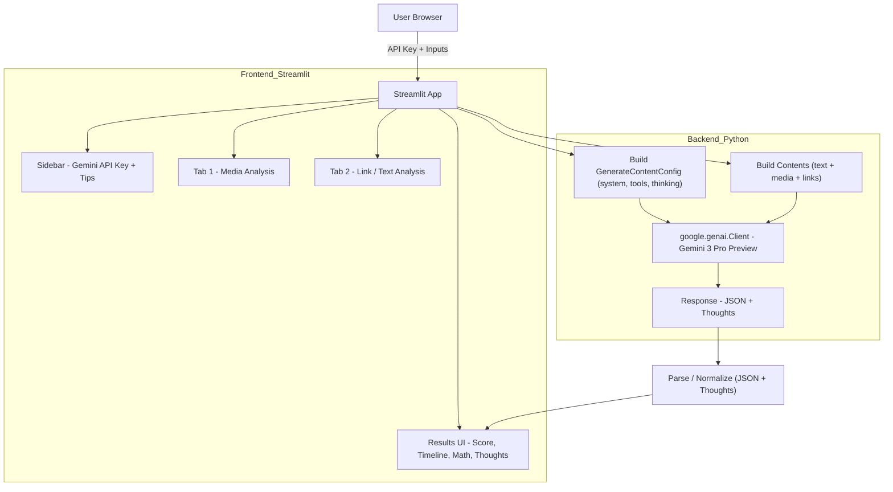
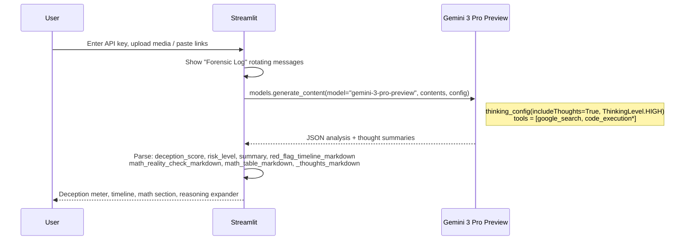

## The Scrutinizer – Digital Forensic Deception Analysis

The Scrutinizer is a **Streamlit** app powered by **Gemini 3 Pro Preview** and the **google-genai** SDK.  
It acts as a **forensic scam investigator**, analyzing **video, images, audio, links, and text** to detect:

- Deceptive or manipulated content (deepfakes, edited clips, synthetic voices)
- Social engineering tricks and scam patterns
- Unrealistic financial promises using **code execution–backed math checks**
- Inconsistencies against the live web via **Google Search grounding**

The app is designed for **hackathon judges, security researchers, and investigative journalists** who want a clear, explainable risk assessment backed by modern multimodal AI.

---

## Key Features

- **Gemini 3 Pro Preview (google-genai)**  
  - `thinking_config` with `include_thoughts=True` and `ThinkingLevel.HIGH`  
  - **Google Search tool** for grounding claims in real‑time web data  
  - **Code Execution tool** for math proofs and numeric sanity checks  

- **Two main analysis modes**
  - `🎥 Video / Image / Audio Analysis`  
    - Upload **one or more** media files (video, audio, images) simultaneously  
    - Detect deepfakes, edited content, impersonation, pressure tactics, etc.  
  - `🔗 Link / Text Analysis`  
    - Paste suspicious links and/or text (emails, DMs, scripts, sales pages)  
    - Identify phishing, refund scams, fake support, Ponzi patterns, romance scams

- **Forensic UI outputs**
  - **Deception Score / Scam Score (0–100)** with a visual meter  
  - **Red Flag Timeline** – chronological bullet list of key issues  
  - **Forensic Summary** – concise narrative digest of the findings  
  - **Math Reality Check** – markdown narrative + optional table showing:
    - Implied returns from claimed investments
    - Comparisons vs. realistic benchmarks (e.g., S&P 500)
  - **Forensic Safety Briefing** – practical advice and next steps
  - **Forensic Reasoning (Thinking Process)** – expandable view of Gemini’s internal thinking summaries

- **Engagement & UX polish**
  - **Forensic Log** – dynamic rotating status messages (e.g. “Scanning metadata…”) while the model thinks  
  - **Forensic Tips** – sidebar “Did you know?” style anti‑scam tips  
  - Dark, “forensic lab” themed UI with custom CSS

---

## Architecture Overview

### High-Level Diagram



### Request Flow



\* Code execution is used for text/link analysis and selectively disabled for certain media-only calls to avoid MIME/tool conflicts.

---

## Tech Stack

- **Language**: Python 3.12+
- **Frontend**: Streamlit
- **AI SDK**: `google-genai`
- **Model**: `gemini-3-pro-preview`
- **Tools Used**:
  - `google_search` (Grounding with Google Search)
  - `code_execution` (Python code execution tool)
  - `thinking_config` with thought summaries

---

## Setup & Installation

### 1. Clone the repository

```bash
https://github.com/abdelaalimouid/The-Scrutinizer.git
cd The-Scrutinizer
```

### 2. (Recommended) Create and activate virtual environment

```bash
python -m venv venv
source venv/bin/activate  # macOS / Linux
# On Windows: .\venv\Scripts\activate
```

### 3. Install dependencies

```bash
pip install -r requirements.txt
```

`requirements.txt`:

```text
google-genai
streamlit
```

### 4. Set your Gemini API key

You can either:

- **Use the sidebar field** in the app (recommended), or  
- Set an environment variable before running:

```bash
export GEMINI_API_KEY="your-api-key-here"
# or: export GOOGLE_API_KEY="your-api-key-here"
```

---

## Running the App

```bash
streamlit run app.py
```

Then open the URL shown in the terminal, typically:

- `http://localhost:8501`

---

## Usage Guide

### Sidebar

- **Gemini API Key**  
  Paste a valid **Gemini API / Google API key**.
- **Forensic Tip**  
  Rotating anti-scam tips to educate users.

### Tab 1 – 🎥 Video / Image / Audio Analysis

1. **Upload media**  
   - Supported extensions: `mp4, mov, mkv, webm, mp3, wav, m4a, jpg, jpeg, png`
   - You can upload **multiple files at once** to showcase the 1M‑token context window.
2. (Optional) Add **Context**  
   - e.g. “Sent via WhatsApp by ‘support’,” “Claimed to be X CEO,” etc.
3. Click **Run Forensic Scan**  
   - Watch the **Forensic Log** messages while Gemini thinks.
4. Inspect Results:
   - **Deception Score** meter (0–100) and risk label.
   - **Forensic Summary** of the entire media batch.
   - **Red Flag Timeline** with chronological issues.
   - **Math Reality Check** (if financial claims are present).
   - **Forensic Safety Briefing** with plain-language advice.
   - **Thinking Process** expander with Gemini’s internal reasoning summaries.

### Tab 2 – 🔗 Link / Text Analysis

1. Paste a **suspicious link** and/or **text**:
   - Phishing email, DM screenshot text, “investment” pitch, call script, landing page copy, etc.
2. Click **Run Forensic Scan on Text / Link**.
3. Examine:
   - Deception / scam score.
   - Red flags and scam pattern classification.
   - Detailed math arguments when numbers don’t add up.
   - Forensic reasoning and safety guidance.

---

## Configuration Details (for reviewers)

The app uses `google-genai` like this (simplified):

```python
from google import genai
from google.genai import types

client = genai.Client(api_key=api_key)

config = types.GenerateContentConfig(
    system_instruction=build_system_prompt(),
    tools=[
        types.Tool(google_search=types.GoogleSearch()),
        types.Tool(code_execution=types.ToolCodeExecution()),  # selectively disabled for raw media
    ],
    thinking_config=types.ThinkingConfig(
        include_thoughts=True,
        thinking_level=types.ThinkingLevel.HIGH,
    ),
    response_mime_type="application/json",
    response_schema={ ... },  # structured output: scores, summary, timeline, math, etc.
    temperature=1.0,
    top_p=0.9,
)
```

- **System prompt**: frames the model as “The Scrutinizer”, a forensic scam investigator, and **forces** JSON output with:
  - `deception_score` and `scam_score` (0–100),
  - `risk_level`, `summary`,
  - `red_flag_timeline_markdown`,
  - `math_reality_check_markdown`, `math_table_markdown`,
  - `advice_markdown`.

- **Thoughts / internal monologue**:  
  We enable `include_thoughts=True` and capture parts with `part.thought == True`, surfacing them in a collapsible **“Forensic Reasoning”** section.

---

## Extensibility Ideas

If you want to take this beyond the hackathon:

- **Case Export**: Add export to JSON/Markdown for integration with ticketing systems.
- **User Accounts & Case History**: Store prior analyses for patterns over time.
- **Team Notes**: Allow analysts to annotate and save manual observations alongside model output.
- **Policy Templates**: Predefined checklists for sectors (finance, HR, support) that tailor risk labels.

---

## Limitations & Notes

- **Not a legal or financial advisor**: Results are heuristic and probabilistic.
- **Media handling**:  
  - Videos, images, and audio are passed as Gemini contents; some rare MIME/tool combinations may require small adjustments.
- **Long context**:  
  - The app is designed to highlight Gemini’s large context window, but extreme batches of very large videos may still hit runtime or practical limits.

---

## Credits

- Built for the **Gemini Hackathon** to showcase:
  - **Thinking models** with visible reasoning,
  - **Grounded answers** via Google Search,
  - **Executable math** via code execution tools,
  - And a **forensic‑grade UX** tailored to fighting scams and deepfakes.

